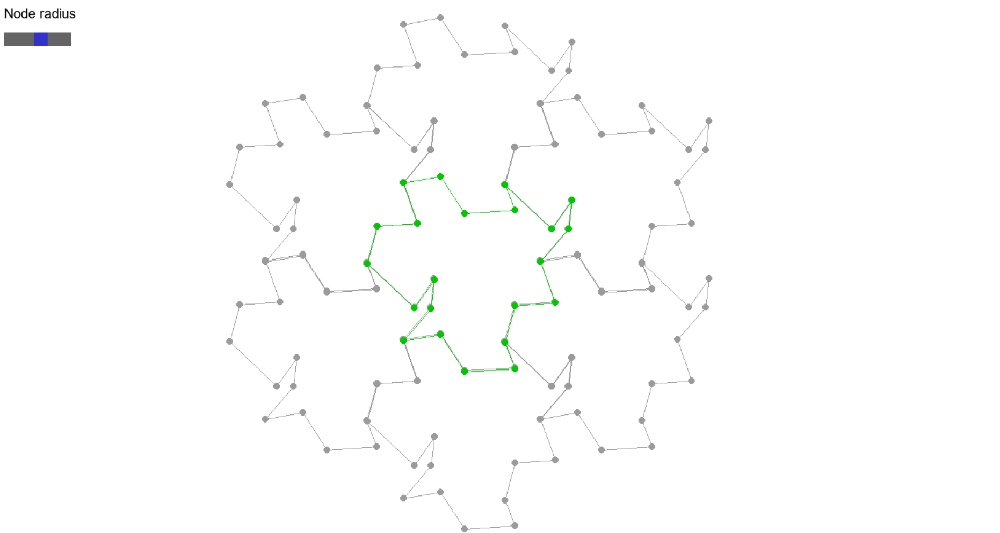

# Escher parquets  
Escher parquet - tiling of a plane with identical figures without gaps or overlaps. 
This program is a convenient editor for such parquets.  

### How to install this project
1. Clone the repository
2. Run command `pip install -r requirements.txt`. If it doesn't work try `pip3 install -r requirements.txt`
3. Run file `main.py`
### Control  
- Grab the node of the main (green) shape (right mouse button) and pull it to change the shape of the parquet.  
- When you click on a node with the left mouse button, it will be deleted  
- When you click on the mouse wheel, a neighbor will appear at the vertex closest to the click location
- Scrolling the mouse wheel will change the dimensions of the parquet
- The size of the nodes can be changed using the slider located in the upper left corner of the screen

Thank you for your interest in my project!